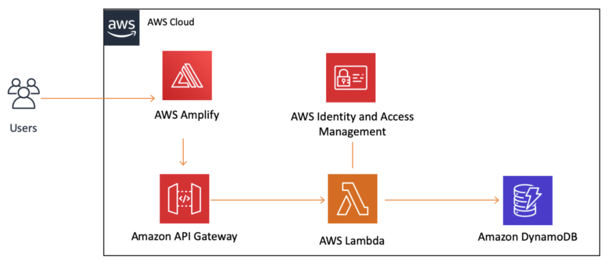
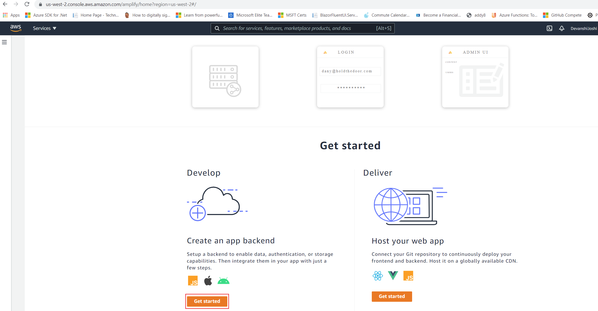
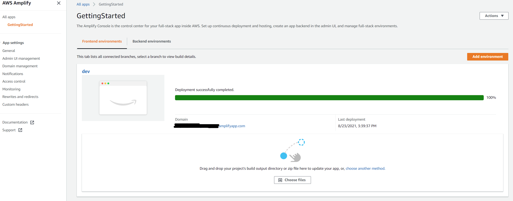
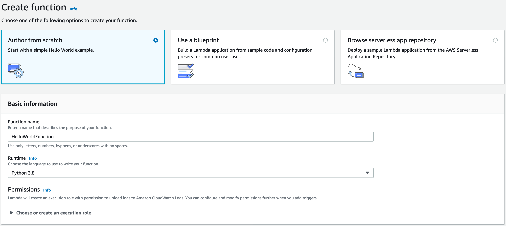
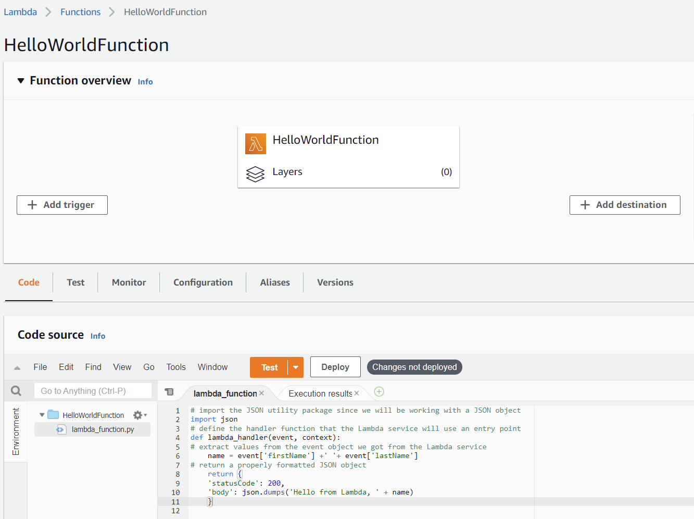

# Welcome to the AWS Lambda for Azure Functions user's tutorial (GUI edition)

To get the most from this tutorial, you must know how to hoost  on Azure. In this tutorial you will build an EKS cluster on AWS, deploy worker nodes and install a simple guestbook application. You will be using AWS' `us-west-2` region to deploy your EKS cluster. 

This is a free lab that takes 30 minutes to complete. Make sure you terminate all the services at the end of this lab. 

## Overview

In this tutorial, you will create a simple web application. You will first build a static web app that renders "Hello World." Then you will learn how to add functionality to the web app so the text that displays is based on a custom input you provide.
This tutorial will walk you through the steps to create this sample web application. You will learn to:
- Create a web app
- Connect the web app to a serverless back-end
- Add interactivity to your web app with an API and a database

## Application Architecture

- **AWS IAM -** 
- **AWS Amplify -** All of your static web content, including HTML, CSS, JavaScript, images and other files, will be hosted by [AWS Amplify.](https://docs.aws.amazon.com/amplify/latest/userguide/welcome.html)
- **Amazon API Gateway -**
- **AWS Lambda -** You will use the compute service [AWS Lambda](https://docs.aws.amazon.com/lambda/latest/dg/welcome.html), to create serverless functions, writing a small piece of code in Python to add interactivity to your web page.
- **Amazon DynamoDB -**

## **Step 0: Before You Start**

You will need to make sure you have the following components installed and set up before you start with Amazon EKS:

- **AWS Account –** Sign up for a free AWS account [here.](https://aws.amazon.com/premiumsupport/knowledge-center/create-and-activate-aws-account/)
- **Required IAM permissions** – The IAM security principal that you're using must have permissions to work with AWS Lambda IAM roles and service linked roles. You must complete all steps in this guide as the same user.
  
## **Step 1: Create Web App**
You will use the AWS Amplify Console to deploy the static resources for your web application.

1.1 Open your favorite text editor on your computer. Create a new file and **paste** the following HTML in it:

~~~
<!DOCTYPE html>
<html>
<head>
    <meta charset="UTF-8">
    <title>Hello World</title>
</head>

<body>
    Hello World
</body>
</html>
~~~

1.2 **Save** the file as *index.html*.

1.3 **ZIP (compress)** only the HTML file.

1.4. In a new browser window, log into the [Amplify Console](https://us-west-2.console.aws.amazon.com/amplify/home). NOTE: We will be using the **Oregon (us-west-2) region** for this tutorial.

1.5 Click the orange **Get Started** button.

1.6 In the **App Name** field type *GettingStarted*.

1.7 Under **Frontend environments** tab select **Deploy without Git provider**. This is what you should see on the screen:

1.8 Click the orange **Connect branch** button.

1.9 For **Environment** name type *dev*. Select the **Drag and drop** method. This is what you should see on your screen:

1.10 Click the **Choose files** button. Select the ZIP file you created in Step 1.3. Click the orange **Save and deploy** button. After a few seconds, you should see the message *Deployment successfully completed*.

## **Step 2: Test your Web App**

2.1 Click on the link under **Domain**.

2.2 Your web app will load in a new browser tab and render "Hello World." Congratulations!

We now have live web app users can interact with. Next we will create a Lambda function.

## **Step 3: Create and Configure your Lambda Function**

3.1 In a new browser tab, log into the [AWS Lambda Console.](https://console.aws.amazon.com/lambda/)

3.2 Make sure you **note that the region you are creating your function in is set to Oregon (us-west-2)**. You can see this at the very top of the page, next to your account name.

3.3 Click on the orange **Create Function** button.

3.4 Under **Function Name** type in *HelloWorldFunction*.

3.5 Select **Python 3.8** from the **runtime** drop-down.

3.6 Click on the orange **Create Function** button. You should see a green box at the top of your screen with the following message *Successfully created the function.*

3.7 Replace the code under the Function **Code** tab with the following:

~~~
# import the JSON utility package since we will be working with a JSON object
import json
# define the handler function that the Lambda service will use an entry point
def lambda_handler(event, context):
# extract values from the event object we got from the Lambda service
    name = event['firstName'] +' '+ event['lastName']
# return a properly formatted JSON object
    return {
    'statusCode': 200,
    'body': json.dumps('Hello from Lambda, ' + name)
    }
~~~

3.8 Click the **Deploy** button.

3.9 Let's test our new function. Click on the **Test drop down** button. From that drop-down menu click on **Configure test event**.

3.10 Under **Event Name** type *HelloWorldTestEvent*.

3.11 Copy and paste the following JSON object to replace the default one:

~~~
{
"firstName": "Ada",
"lastName": "Lovelace"
}
~~~

3.12 Click the orange **Create** button a the bottom of the page.

3.13 Click the grey **Test** tab at the top to view the saved test event. Click on the orange **Test** button on the right to run the test and view results. You should see a light green box at the top of the page with the following text: "Execution result: succeeded." You can click on "details" to see the event the function returned.

Well done! You now have a working Lambda function.

## **Step 4: Create a new REST API**

4.1
