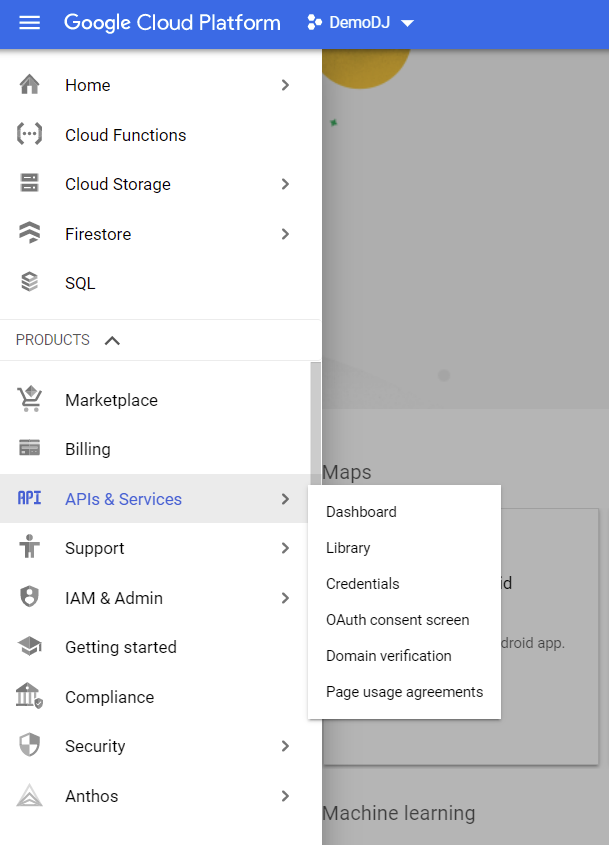
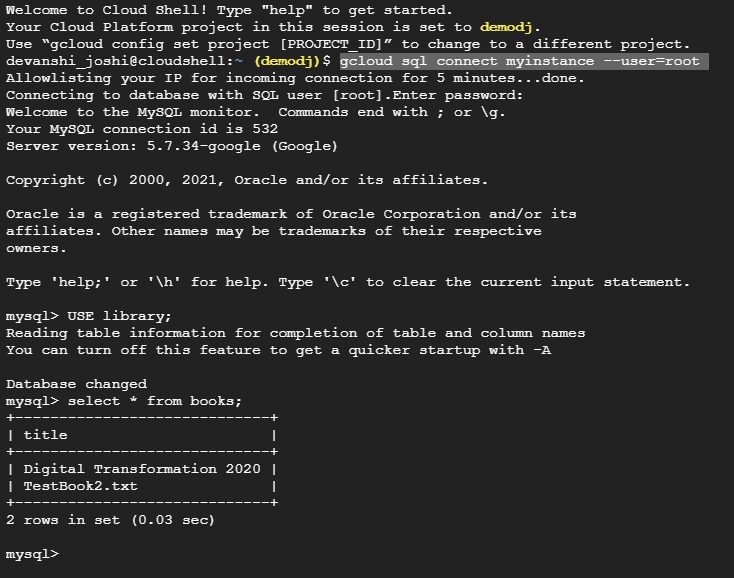

# GCP Cloud Functions for Azure Functions user's tutorial (GUI edition)

To get the most from this tutorial, you must know how to deploy applications using Azure Funcitons. 

This is a free lab that takes 30 minutes to complete. Make sure you terminate all the services at the end of this lab. 

## Overview

In this tutorial, you will create a simple library processing system. When a new text document is added to the source bucket, your function will add this to the books collection in the database.
This tutorial will walk you through the steps to create this sample processing system. You will learn to:
- Create a serverless back-end function
- Add interactivity to your function with storage and database
- Add security to the function operations

## Application Architecture

- **Cloud Storage -** We will use the [Cloud Storage](https://cloud.google.com/storage) to store new documents to be processed by the function.
- **Cloud Functions -** All of your business process logic will be hosted by [Cloud Functions.](https://cloud.google.com/functionsl) to run your code with zero server management.
- **Secret Manager -** You will use [Secret Manager](https://cloud.google.com/secret-manager) to manage, access, and audit secrets across Google Cloud.
- **Cloud SQL -** You will use the fully managed relational database service for MySQL, [Cloud SQL](https://cloud.google.com/sql), to write data from within serverless functions, writing a small piece of code in Python to add interactivity to your funciton.

## Step 0: Before You Start

You will need to make sure you have the following components installed and set up before you start with Amazon EKS:

- **GCP Account –** Sign up for a free GCP account [here.](https://cloud.google.com/free/docs/gcp-free-tier)

## Step 1: Select a Project

If you haven’t created a project yet, create a project. 

Select the project you have created from the dropdown list

## Step 2: Enable APIs

2.1. For each service you use, you need to ensure the Google cloud APIs are enabled. From the cloud console, go to the API and Services page.

2.2. Select  **+Enable APIs and Services**.

2.3. Enable the following APIs:

- Cloud Functions API
- Secret Manager API
- Cloud Build API
- Compute Engine API

## Step 3: Create the Library Database

### 3.1. Create Cloud SQL Instance

3.1.1. Go to [Cloud SQL.](https://console.cloud.google.com/sql)

3.1.2. Select **Create Instance**.

3.1.3. Select **Choose MYSQL**.

3.1.4. For **Instance ID**, type *myinstance*.

3.1.5. Add a **Passowrd** to access your database with secured privileges.

3.1.6. Select `us-west3 (Salt Lake City)` for **Region**.

3.1.7. Select *Single Zone* for **Zonal availability**.

3.1.8. Select **Show Configuration Options** under Customize your instance.

3.1.9. Select *Shared core* as your **Machine Type**.

3.1.10. Under Storage, select *10 GB* as **Storage capacity**. *Uncheck* **Enable automatic storage increases**.

3.1.11. Under Backups, *uncheck* **Automate backups** and **Enable point-in-time recovery**.

3.1.12. Click **CREATE INSTANCE**.

3.1.13. **Copy and save** the **Connection name** under the Overview tab (you will need it in [Step 5](https://github.com/devanshidiaries/Serverless/tree/main/GCP%20Cloud%20Functions#step-5-add-security-for-database-connection)).

### 3.2. Create Books Table in the Library Database

3.2.1. Setup **Cloud Shell**. Click on the **Activate Cloud Shell** icon on the top right corner in GCP Console.

3.2.2. Use the below command in cloud shell to connect to your database instance created in [Step 3.1.](https://github.com/devanshidiaries/Serverless/tree/main/GCP%20Cloud%20Functions#31-create-cloud-sql-instance) Click **Authorize** when prompted.

~~~
gcloud sql connect myinstance --user=root
~~~

3.2.3. When prompted, type the password you created in the [Step 3.1.5.](https://github.com/devanshidiaries/Serverless/tree/main/GCP%20Cloud%20Functions#31-create-cloud-sql-instance) and press the *Enter* key.

3.2.4. Use the below SQL commands to create a database named *library* and a table named *books*.

~~~
CREATE DATABASE library;
USE library;
CREATE TABLE books (title VARCHAR(100));
INSERT into books (title) VALUES ("Digital Transformation 2020");
~~~

3.2.5. To verify the insertion of the first record from the last command, use the below SQL command

~~~
select * from books;
~~~

You should see 1 row set as shown below

## Step 4: Create Source Bucket

4.1. Go to [Cloud Storage.](https://console.cloud.google.com/storage)

4.2. Select **+Create Bucket**.

4.3. Name your bucket - *docs\<yournameinitials\>*, for e.g. *docsdj*.

4.4. For **Location type**, select *Region*. In the **Location** drop down options, select `us-west3 (Salt Lake City)`.

4.5. Select *Standard* for **Choose default storage class for your data**.

4.6. Click the **Create** button.

## Step 5: Add Security for Database Connection

5.1. Go to [Secret Manager.](https://console.cloud.google.com/security/secret-manager)

5.1. Select **+ Create Secret**.

5.2. For **Name**, type *dbconnectionname*. In the **Secret Value** field, type the *\<Database Connection Name\>* saved in [Step 3.1.13.](https://github.com/devanshidiaries/Serverless/tree/main/GCP%20Cloud%20Functions#31-create-cloud-sql-instance) Click **CREATE SECRET**.

5.3. Go back to the Secret Manager Parent Page. Repeat Steps 5.1. and 5.2. to create 2 additional secrets.
- Secret Name: *dbuser* and Secret Value: *root*
- Secret Name: *dbpassword* and Secret Value: *\<type the password you created in the [Step 3.1.5.](https://github.com/devanshidiaries/Serverless/tree/main/GCP%20Cloud%20Functions#31-create-cloud-sql-instance)>*

## Step 6: Create Serverless Function

### 6.1. Create a function.

6.1.1. Go to [Cloud Functions.](https://console.cloud.google.com/functions)

6.1.2. Select **Create Function**.

6.1.3. For **Function name**, type *librarysys*.

6.1.4. Select `us-west3` as the **Region**.

6.1.5. Select *Cloud Storage* as the **Trigger Type**.

6.1.6. Select *Finalize/Create* as the **Event Type**.

6.1.7. Click on **BROWSE** to select the source bucket you create in [Step 4.](https://github.com/devanshidiaries/Serverless/tree/main/GCP%20Cloud%20Functions#step-4-create-source-bucket)

6.1.8. Click on **SAVE**.

### 6.2. Add Security Settings

6.2.1. Select the **Secrets** tab. Click on **REFERENCE A SECRET**.

6.2.2. Click on **REFERENCE A SECRET**. 

6.2.3. In the **Secret** field, select *dbconnectionname*. **GRANT** the function permission to access the secret. 

6.2.4. Select *Exposed as environment variable* for the **Reference Method**.

6.2.5. Type *dbcon* in the **Name** field for **Environment variables**. Click **DONE**.

6.2.6. Repeat Step 6.2.2 to Step 6.2.5 for the remaining 2 secrests. 
- For *dbuser* secret, type *username* as the Environment variable Name.
- For *dbpassword* secret, type *password* as the Environment variable Name.

6.2.7. Click the **NEXT** button.

### 6.3. Complete the Function Code

6.3.1. Select *Python 3.7* for **Runtime**.

6.3.2. In the `main.py` file, delete the existing code and paste the following code snippet.
~~~
import os
import sqlalchemy
connection_name = os.environ["dbcon"]
table_name = "books"
table_field = "title"
#table_field_value = "event['name']"
db_name = "library"
db_user = os.environ["username"]
db_password = os.environ["password"]
driver_name = 'mysql+pymysql'
query_string = dict({"unix_socket": "/cloudsql/{}".format(connection_name)})

def hello_gcs(event, context):
    #book = event
    print("New book entry will be: {}".format(event['name']))
    stmt = sqlalchemy.text('insert into {} ({}) values ("{}")'.format(table_name, table_field, event['name']))
    print("stmt: {}".format(stmt))
    db = sqlalchemy.create_engine(
      sqlalchemy.engine.url.URL(
        drivername=driver_name,
        username=db_user,
        password=db_password,
        database=db_name,
        query=query_string,
      ),
      pool_size=5,
      max_overflow=2,
      pool_timeout=30,
      pool_recycle=1800
    )
    try:
        with db.connect() as conn:
            conn.execute(stmt)
    except Exception as e:
        return 'Error: {}'.format(str(e))
    return 'ok'
~~~

6.3.3. In the `requirements.txt` file, delete the existing code and paste the following code snippet.
~~~
# This file tells Python which modules it needs to import
functions-framework==2.2.1
SQLAlchemy==1.3.12      
PyMySQL==0.9.3
~~~

6.3.4. Click the **DEPLOY** button at the bottom.

## Step 7: Test the Solution

7.1. Go to your Cloud Storage Bucket (created in [Step 4](https://github.com/devanshidiaries/Serverless/tree/main/GCP%20Cloud%20Functions#step-4-create-source-bucket))

7.2. Drag and drop a `.txt` file.

- This action activates the Cloud Storage trigger for Cloud Functions, firing your `librarysys` function we created in [Step 6.](https://github.com/devanshidiaries/Serverless/tree/main/GCP%20Cloud%20Functions#step-6-create-serverless-function)
- Your `.txt file name` gets extracted and added to your `books` table in the `library` database.

7.3. Connect to your database instance using Cloud Shell as defined in [Step 3.2.](https://github.com/devanshidiaries/Serverless/tree/main/GCP%20Cloud%20Functions#32-create-books-table-in-the-library-database)

7.4. Once connected, use the below commands to verify the insertion from the Cloud Function.
~~~
USE library;
select * from books;
~~~

7.5. You should see a similar output as shown below.

> Congratulations, you've successfully built the Library Processing System.
> Specifically, you've created a Cloud Function that triggers on Cloud Storage and, connects and writes to a Cloud SQL database instance.

## Step 8: Clean Up

This brings us to the end of the Hand-on-Lab. To avoid incurring charges to your Google Cloud account for the resources used in this lab, follow these steps.

### 8.1. Delete the Cloud SQL instance

8.1.1 Go to the [Cloud SQL Instances page](https://console.cloud.google.com/sql) in the Google Cloud Console.

8.1.2. Select the instance you created to open the Instance details page.

8.1.3. In the icon bar at the top of the page, click **Delete**.

8.1.4. In the Delete instance window, type the name of your instance, then click **Delete** to delete the instance. You cannot reuse an instance name for about 7 days after an instance is deleted.

### 8.2. Delete the Cloud Function

8.2.1. Go to the [Cloud Functions page](https://console.cloud.google.com/functions) in the Google Cloud Console.

8.2.2. Select the three dots under **Actions** for your function and choose **Delete**.

8.2.3. Confirm deletion by clicking the **DELETE** button.

### 8.3. Delete Cloud Storage Bucket

8.3.1. Go to the [Cloud Storage page](https://console.cloud.google.com/storage/browser)

8.3.2. Select the bucket you created.

8.3.3. In the icon bar at the top of the page, click **Delete**.

8.3.4. Confirm deletion by clicking the **DELETE** button.
